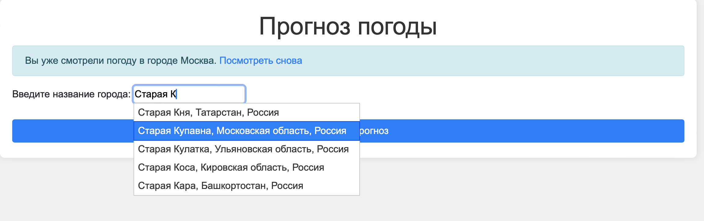
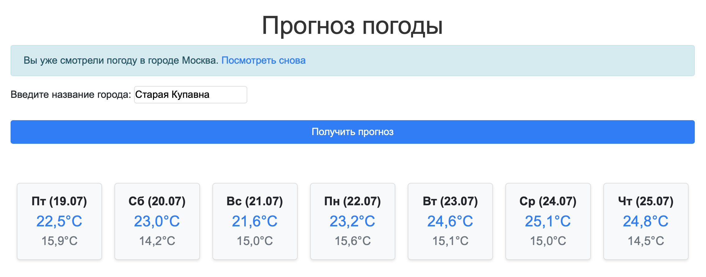
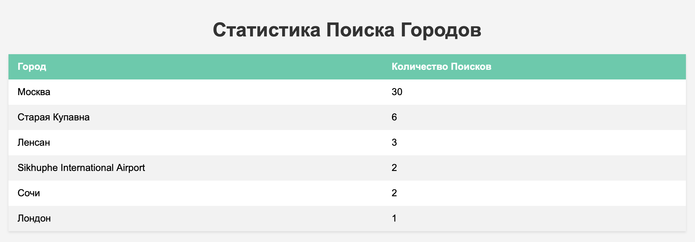

# Weather Project

## Используемые технологии

- **Python**
- **Django**
- **HTML**,**CSS** **JS**
- **jQuery**.
- **Bootstrap**
- **SQLite**
- **Api для погоды** [Open Meteo](https://open-meteo.com/)

## Функционал:
- **Автозаполнение названия города**: Использование jQuery UI для автозаполнения поля ввода города.

- **Отображение прогноза погоды**: Вывод прогноза на несколько дней вперед в виде карточек с информацией о максимальной и минимальной температуре.

- **История запросов**: Отображение последнего просмотренного города.

- **Статистика запросов**: Отображение количества запросов для каждого города.

- **Тесты**

## Запуск проекта

1. Клонируйте репозиторий:

    ```bash
    git clone https://github.com/IlyaFiskhanov/weather_project.git
    cd weather_project
    ```
2. Установите зависимости:

    ```bash
    pip install -r requirements.txt
    ```
3. Примените миграции:

    ```bash
    python manage.py migrate
    
    ```
4. Запустите сервер разработки:

    ```bash
    python manage.py runserver
    ```
5. Откройте веб-браузер и перейдите по адресу [http://127.0.0.1:8000](http://127.0.0.1:8000).

## Использование

Для получения прогноза погоды введите название города в поисковое поле и нажмите "Получить прогноз".


## Статистика запросов
Для просмотра статистики запросов введите в строку браузера:
```html
http://127.0.0.1:8000/city_statistics/
```


## Запуск тестов

```bash
python manage.py test
```

```python
#tests.py
from django.test import TestCase, Client
from django.urls import reverse

class WeatherAppTests(TestCase):
    def setUp(self):
        self.client = Client()
        self.index_url = reverse('index')
        self.autocomplete_url = reverse('city_autocomplete')
# Проверяем GET-запрос к главной странице
    def test_index_view_get(self):
        response = self.client.get(self.index_url)
        self.assertEqual(response.status_code, 200)  
        self.assertTemplateUsed(response, 'weather/index.html') 
        self.assertIn('form', response.context)
 # Проверяем GET-запрос к функции автозаполнения с параметром 'term'
    def test_city_autocomplete(self):
        response = self.client.get(self.autocomplete_url, {'term': 'Старая'})
        self.assertEqual(response.status_code, 200)  
        self.assertEqual(response['Content-Type'], 'application/json') 
        data = response.json()
        self.assertIsInstance(data, list)  
        if data:
            self.assertIn('label', data[0]) 
            self.assertIn('value', data[0]) 

```
```bash
weather_project % python3 manage.py test     
Found 2 test(s).
Creating test database for alias 'default'...
System check identified some issues:

WARNINGS:
?: (staticfiles.W004) The directory '/Users/sale/Programing/weather_project/static' in the STATICFILES_DIRS setting does not exist.

System check identified 1 issue (0 silenced).
..
----------------------------------------------------------------------
Ran 2 tests in 0.222s

OK
Destroying test database for alias 'default'...
```


# Спасибо, что посмотрели мой проект!
### Если у вас есть вопросы или предложения, не стесняйтесь обращаться.

